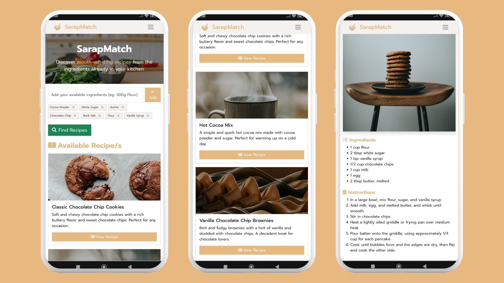

# 🍳 SarapMatch

> **Turn your random kitchen ingredients into delicious meals, instantly.**  

[**🌐 Live Website**](https://benjaminn1202.github.io/SarapMatch/)  

---

## 🌟 About  
Hi! I’m Benjamin, and I created **SarapMatch** because I know the feeling of standing in the kitchen, staring at random ingredients, and thinking:  

> *"Ano lulutuin ko?"*  

SarapMatch is designed to be **fun**, **useful**, and **easy to use**, helping you turn what you already have into something delicious.

---

## 🚀 How It Works  

1. **Add Ingredients**  
   List down what’s in your kitchen, no matter how simple.  

2. **Find Recipes**  
   Using AI from **DeepSeek** and images from **Unsplash**, SarapMatch finds the best recipes for you.  

3. **Cook & Enjoy**  
   Follow simple steps and enjoy your homemade meal.  

---

## 🛠 Built With  

- **[Bootstrap](https://getbootstrap.com/)**
- **Custom CSS**
- **HTML & JavaScript**
- **[DeepSeek API](https://deepseek.com/)**
- **[Unsplash API](https://unsplash.com/developers)**

---
